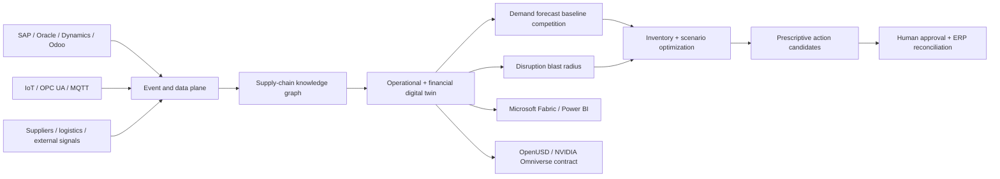

# Supply Chain Digital Twin and Inventory Optimization Platform

## Artificial Intelligence, Machine Learning, Data Science, Microsoft Fabric, Power BI, IoT, Demand Forecasting and Predictive Analytics

**SupplyTwin AI** is an open-source supply-chain decision engine that connects supplier disruption, bills of materials, inventory, demand forecasting, service levels and working-capital economics. It compares feasible responses and emits a deterministic, human-controlled recommendation receipt.

> **Claim boundary:** the included manufacturer, demand, inventory, disruption, costs and outcomes are synthetic. No SAP, Oracle, Dynamics, Odoo, factory, supplier, shipment or physical system is connected, and no purchasing or production action is executed.

## Business problem

Stockouts lose contribution and customers. Excess inventory traps cash and incurs carrying cost. Supplier delays, quality failures, factory downtime and logistics disruption continuously invalidate static plans. SupplyTwin connects technical events to service level, revenue exposure, margin, inventory and incremental cash.

## Architecture



## Executable manufacturer case study

```bash
pip install -e '.[test]'
pytest -q
supplytwin examples/global-manufacturer/disruption.json --output generated/global-manufacturer
```

The scenario models a 14-day semiconductor delay affecting industrial controllers and edge gateways. The engine:

1. Competes seasonal-naïve and moving-average forecasts.
2. Propagates disruption through the bill of materials.
3. Calculates revenue, contribution, penalties and inventory carrying cost separately.
4. Evaluates do-nothing, expediting, reallocation and component-substitution actions.
5. Enforces cash, service-level and quality constraints.
6. Selects only from feasible actions.
7. Blocks autonomous execution.
8. Emits a reproducible SHA-256 receipt.

## Predictive and prescriptive analytics

A complex forecasting model must beat a transparent baseline before promotion. Prescriptive actions maximize modeled net value only inside service-level, cash and quality constraints. This prevents “AI optimization” from recommending financially attractive but operationally unsafe substitutions.

## Unit economics

The reference model distinguishes:

- revenue at risk;
- contribution margin at risk;
- late-delivery penalties;
- incremental action cost;
- inventory carrying cost;
- incremental cash requirement;
- modeled loss avoided.

Cash released from inventory is explicitly not counted as revenue. All values are configurable assumptions, not realized results.

## Azure, Microsoft Fabric and industrial IoT path

The target architecture uses Fabric Real-Time Intelligence, Eventstreams, Eventhouse, OneLake, Power BI, Event Hubs, Azure IoT Operations, MQTT, OPC UA, Azure Machine Learning, Microsoft Foundry, Container Apps or AKS, Azure Maps, API Management, Key Vault and OpenTelemetry. The included Bicep creates a cost-bounded evidence plane; it does not claim a Fabric capacity or live factory deployment.

## Search and international-role positioning

Broad discovery terms: Artificial Intelligence, Machine Learning, Data Science, Business Intelligence, Power BI, Microsoft Fabric, Cloud Computing, Internet of Things, Digital Twin, Supply Chain Management, Inventory Management, Demand Forecasting, Predictive Maintenance, SAP, Oracle, Microsoft Dynamics 365, Kubernetes, DevOps and Data Engineering.

Commercial terms: Inventory Optimization, Supply Chain Optimization, Working Capital Optimization, Stockout Prevention, Supply Chain Digital Twin, Multi-Echelon Inventory, Production Planning, Supplier Risk, Logistics Optimization and Prescriptive Analytics.

Exact search-volume figures are not claimed without Google Keyword Planner, Semrush or Ahrefs. See [the evidence map](docs/search-positioning.md).

## Repository map

```text
src/supplytwin/                         decision engine and CLI
examples/global-manufacturer/           synthetic disruption case study
generated/global-manufacturer/          reproducible decision receipt
infra/azure/                             cost-bounded Azure evidence plane
docs/                                    positioning and production boundaries
tests/                                   behavioral guarantees
```

## Production acceptance

This is an executable decision baseline, not a production supply-chain system. Real deployment requires authorized connectors, master-data reconciliation, forecast monitoring, model registry, managed durable state, identity, event replay, regional recovery, source-system approval workflows and finance-verified outcome measurement. See [production readiness](docs/production-readiness.md).

## Work with A2Z SOC

Need to reduce stockouts, excess inventory, disruption exposure or avoidable expediting? **[Request a Supply Chain Digital Twin and Inventory Optimization Assessment](https://a2zsoc.com)** covering Azure, Fabric, AI, IoT, ERP integration, predictive analytics and unit economics.
